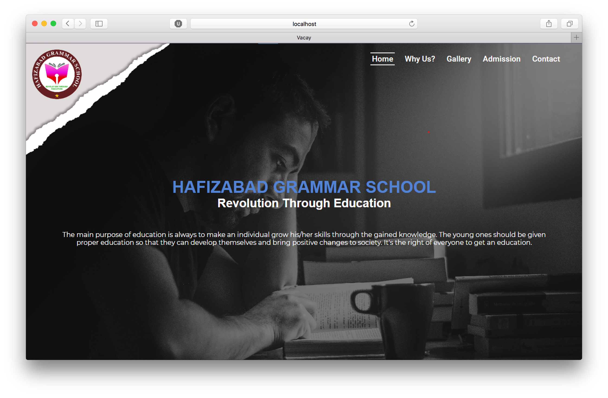

This is a simple responsive website that I created as a practice project for Hafizabad Grammar School. This project helped me learn how to design and implement a responsive web site.

This website is made by 51.1% of HTML, 43.0% of CSS and 5.9% of JavaScript. It took me only jsut 2 weeks to complete as it was my second project. It includes motive, goals and teaching method regarding to the students. Sports Gala, Naat Competition, Qirat Competition and many more religious and co-circullar activites by School.

In this project I gained experience with Front-end web design and associated technologies, including HTML, CSS for the Design and JavaScript that puts special functionality in my Project.

Have a Look to my project : <a href="https://m-naeem66622.github.io/hgs-hfd-project/">Live Demo</a>&nbsp;|&nbsp;<a href="https://github.com/m-naeem66622/hgs-hfd-project">Source Code</a>
