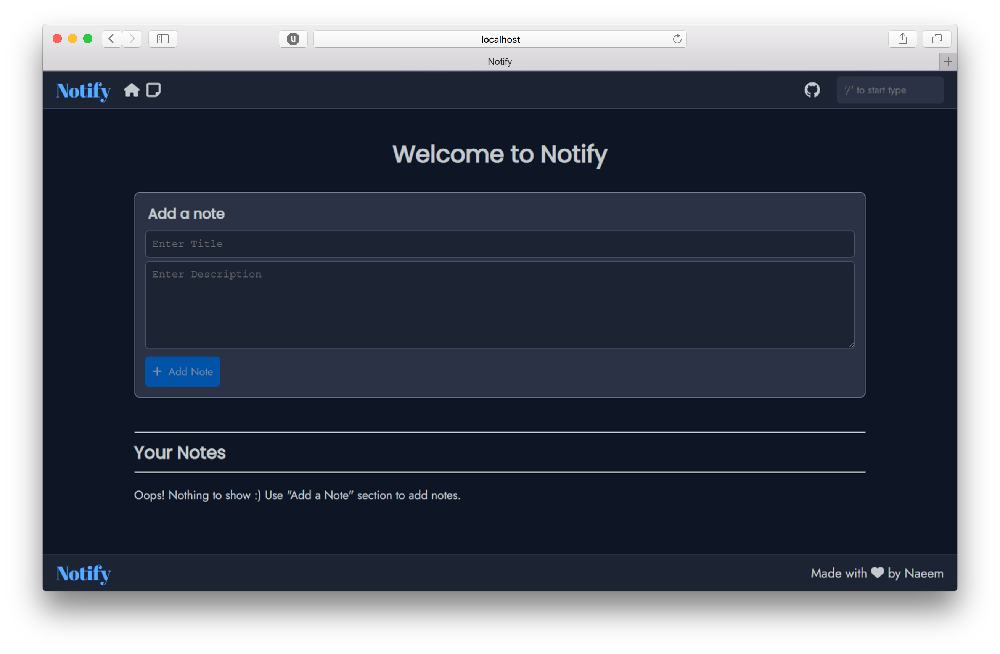

This is a simple responsive website that I created as a practice project fortaking notes. This project helped me learn a lot to design and implement a JavaScript to the responsive website.

This website is made by 26.8% of HTML, 29.7% of CSS and 43.5% of JavaScript. It took me only jsut 3-4 days to complete as it was my third project. But my first project mainly based on JavaScript as you know about statistics of this project. A user can add notes as well as with title. The phenomenon of this project is to save the notes in local storage by using key pair values. You can also search within the bunch of Notes by using search bar at the top.

In this project I gained experience with JavaScript Methods and associated technologies, including HTML, CSS for the Design and FontAwsome that puts the beauty of special icons in my Project.

Have a Look to my project : <a href="https://m-naeem66622.github.io/notify-project">Live Demo</a>&nbsp;|&nbsp;<a href="https://github.com/m-naeem66622/notify-project">Source Code</a>
