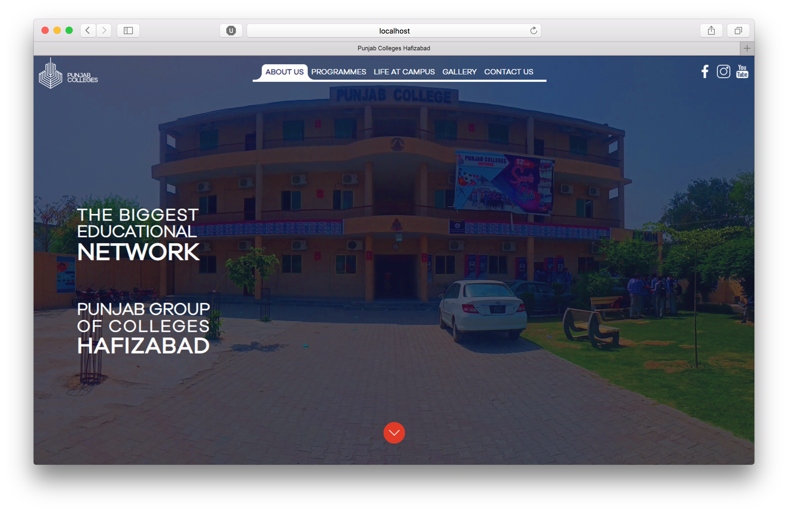

This is a simple responsive website that I created as a practice project for Punjab Group of Colleges. This project helped me learn how to design and implement a responsive web site.

This website is made by 70.8% of HTML, 19.8% of CSS and 9.4% of JavaScript. It took me 2 months to complete as it was my very first Project. It includes the Programmes offeres by College as well as thier Goal and Life at Campus.

In this project I gained experience with Front-end web design and associated technologies, including HTML, CSS for the Design and JavaScript that puts special functionality in my Project.

Have a Look to my project : <a href="https://m-naeem66622.github.io/pgc-hfd-project/">Live Demo</a>&nbsp;|&nbsp;<a href="https://github.com/m-naeem66622/pgc-hfd-project">Source Code</a>
