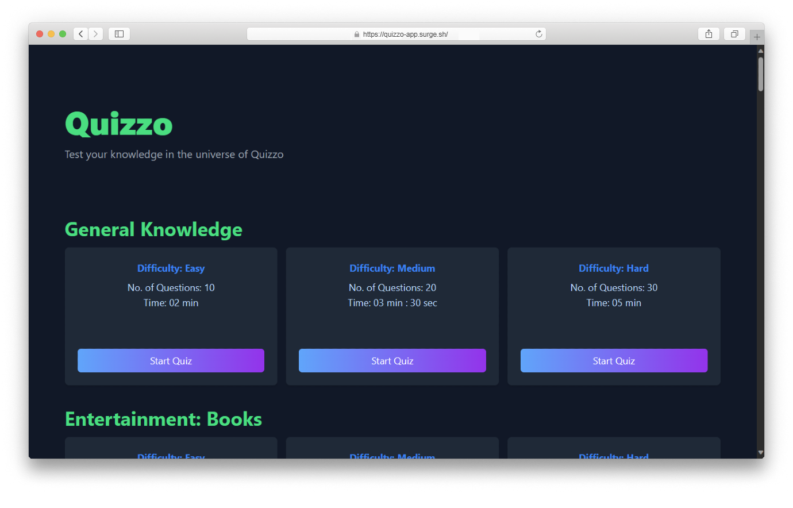

This is a simple responsive website that I created as a practice project in ReactJs. This project helped me learn advance concepts of ReactJs like working with Global State Management with Context API, useEffect Hooks and React Router and auto navigation.

This website is made by 1.9% of HTML, 3.0% of CSS and 95.1% of JavaScript. It took me 2 days to complete. It includes following features:

- **Diverse Categories**: An extensive library of quiz categories to cater to all interests and knowledge levels. From history to science, entertainment to sports, there's a quiz for everyone.

- **Three Difficulty Levels**: Tailor your quiz experience to your expertise. Choose from easy, medium, and hard difficulty levels to match your knowledge and challenge yourself.

- **Interactive Animations**: I've incorporated captivating animations to make the quiz experience more engaging and visually appealing. From smooth transitions between questions to exciting feedback animations, Quizzo keeps you entertained.

- **Skip Quiz**: Have you ever encountered a question you couldn't answer? No worries! Quizzo allows you to skip a question and come back to it later if you have time remaining.

- **Time Management**: You won't have to worry about running out of time. Quizzo displays the total time remaining and automatically submits your quiz when the time is up.

- **Comprehensive Results**: After completing your quiz, Quizzo provides you with a detailed results summary, showing your score and the questions you answered correctly or missed.

In this project I gained experience with Front-end web design, Taliwindcss, React Router and specially UX (User Experience). I learned to manage remaining time with states alongwith scores like skipped, correct, incorrect, attempted etc.

Have a Look to my project : <a href="https://quizzo-app.surge.sh/">Live Demo</a>&nbsp;|&nbsp;<a href="https://github.com/m-naeem66622/quizzo-app">Source Code</a>
