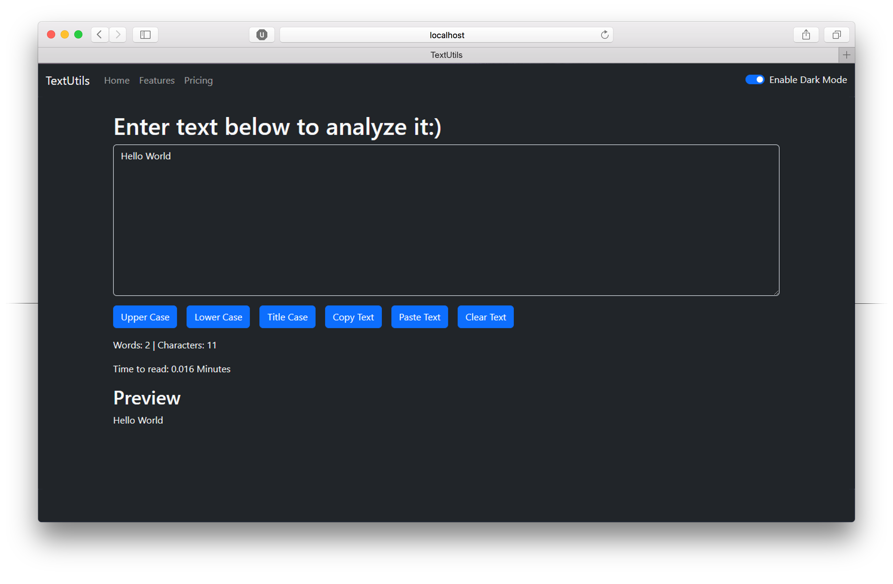

This is a simple responsive website that I created as a practice project in ReactJs. This project helped me learn core concepts of ReactJs like working with States, Props and Components.

This website is made by 18.5% of HTML, 10.7% of CSS and 70.8% of JavaScript. It took me 3 weeks to complete as it was my very first Project in ReactJs. It includes utilities that we can perform on our text like uppercase, lowercase, title case, remove extra spaces etc.

In this project I gained experience with Front-end web design and associated technologies, includingNodeJs, ReactJs and Bootstrap. I learned to manage states alongwith Forms, lifting up sate, variety of hooks and many more.

I apologize for a live demo of my project as React-Router not work with gh-pages (Github Pages).

Have a Look to my project : <a href="https://github.com/m-naeem66622/textutils">Source Code</a>
